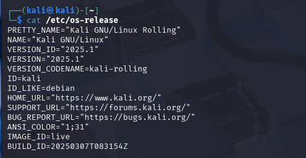
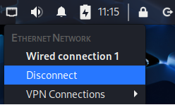
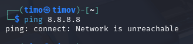
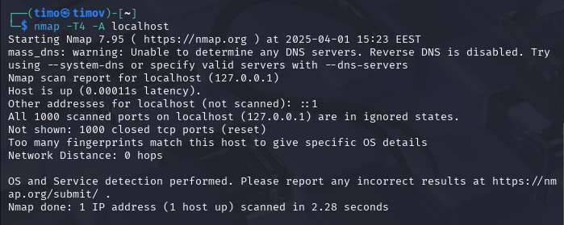
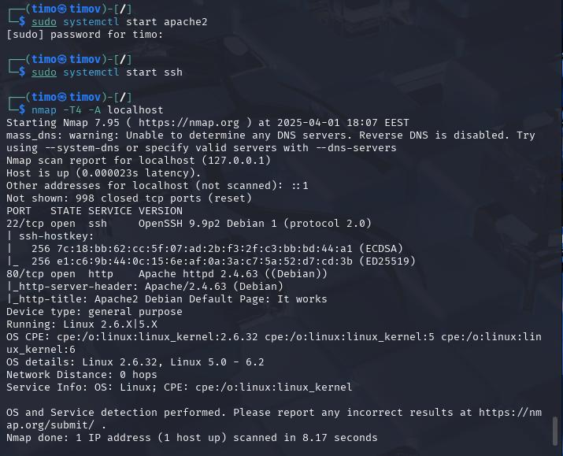

# h1 Kybertappoketju

Tehtävien tekemiseen käytetty laitteisto:

    Malli: Msi GE75 Raider 10sf
    OS: Windows 10 Home 64-bit
    RAM: 16 GB
    CPU: Intel(R) Core(TM) i7-10750H CPU @ 2.60GHz (12 CPUs), ~2.6GHz
    GPU: NVIDIA GeForce RTX 2070
    BIOS: E17E9IMS, 10A

## x) Tiivistelmä

### Herrasmieshakkerit
* Helpompi pitää huolta yhdestä tunnuksesta, kuin useasta maalaisjärkeä käyttäen.
* Bypit virtuaalivaluutta vaihtopalvelua kohtaan hyökättiin helmikuussa väitetysti pohjoiskorean toimesta. Isoin rahallinen menetys koskaan (1.5 miljardia dollaria).
* 

### Intelligence-Driven Computer Network Defense
Informed by Analysis of Adversary Campaigns and
Intrusion Kill Chains

*
*
*

### The Art of Hacking (Video Collection) 4.3 Surveying Essential Tools for Active Reconnaissance

#### Nmap - vakaa ja monipuolinen porttiskanneri
* "-sS" = TCP SYN scan, puoliavoin yheys saa vastauksen, jos portti on auki muttei palauta vastausta. Nopea ja yleinen skannaus.
* "-vv" = lisää verbositeettia, jotta tiedetään tarkemmin mitä skannaus tekee.
* "-T4" = lisää skannauksen nopeutta.
* "-A" = Os detection ja version detection. 

#### Masscan - nopein porttiskanneri
* Pystyy yhden portin kautta skannaamaan koko internetin 3 minuutissa

#### Udpprotoscanner - Nopea UDP porttiskanneri

#### EyeWitness - Voidaan etsiä nopeasti sivuja joiden kimppuun halutaan hyökätä
* Ottaa kuvakaappauksen, jonka perusteella voidaan päätellä halutaanko tähän hyökätä
* 

### KKO 2003:36.

## a) Kali

Kalin asentamisessa ei ilmeentynyt minkäänlaisia ongelmia. Asensin Kalin VM Virtualboxiin.

Komennolla "cat /etc/os-release" tarkistin käyttöjärjestelmän.

## b) Kalin irroitus verkosta

Oikealta yläreunasta löytyi valikko mistä pystyi sulkemaan verkkoyhteyden.

Karvisen materiaaleista löytyvällä "ping 8.8.8.8" komennolla pystyi varmistamaan, ettei verkkoon ole yhteyttä.

## c) Porttiskannaa 1000 tcp-porttia

Skannasin portit komennolla "nmap -T4 -A localhost". Komento löytyy Karvisen kurssimateriaaleista.

Parametrit:
* nmap = Verkkoskanneri
* -T4 = Asettaa nopeuden agressiiviseksi.
* -A = Käynnistää agressiivset ja edistyneet toiminteet mahdollistaen palveluiden ja käyttöjärjestelmän tunnistamisen
* localhost = paikallinenisäntä (oma laite)

Tuhat porttia skannattu localhostin osoitteella ja kaikki portit ovat suljettuna.

## d) Kaksi demonia

Apache ja ssh ovat valmiiksi asennettuna. Käynnistin nämä ja ajoin skannauksen uudeestaan.

Portit 22 (ssh) ja 80 (apache2) ovat auki.

## e) Metasploitable 2 virtuaalikoneeseen

Latasin metasploitable2 sivustolta: (https://sourceforge.net/projects/metasploitable/)

## f) Virtuaaliverkko koneiden välille

## g) Etsi metasploitable

## h) Porttiskannaa metasploitabale

## Lähteet:

Karvinen, T. 2024: Tunkeutumistestaus. Luettavissa: (https://terokarvinen.com/tunkeutumistestaus/) Luettu 1.4.2025

Valkamo, T. 2022: Hacking into a Target Using Metasploit. Luettavissa: (https://tuomasvalkamo.com/PenTestCourse/week-2/) Luettu 1.4.2025

Geeks For Geeks: Check the OS Version in Linux. Luettavissa: (https://www.geeksforgeeks.org/how-to-check-the-os-version-in-linux/) Luettu 1.4.2025

Nmap.org: Nmap Overview and Demonstration. Luettavissa: (https://nmap.org/book/nmap-overview-and-demos.html) Luettu 1.4.2025

sourceforge, rapid7user: Metasploitable. Luettavissa: (https://sourceforge.net/projects/metasploitable/) Luettu 1.4.2025

Hutchins, E. M., Cloppert, M. J., & Amin, R. M. 2011: Intelligence-Driven Computer Network Defense
Informed by Analysis of Adversary Campaigns and
Intrusion Kill Chains. Luettavissa: (https://lockheedmartin.com/content/dam/lockheed-martin/rms/documents/cyber/LM-White-Paper-Intel-Driven-Defense.pdf) Luettu 1.4.2025

Hyppönen, M., Tuominen, T. 2025: Herrasmieshakerit, Silmätaivaalla, vieraana Pekka Laurila | 0x37. Kuunneltavissa: (https://www.withsecure.com/fi/whats-new/podcasts/herrasmieshakkerit) Kuunneltu 1.4.2025

Santos, O., Taylor, R., Sternstein, J., McCoy, C. 2019: The Art of Hacking (Video Collection). Kuunneltavissa: (https://learning.oreilly.com/videos/the-art-of/9780135767849/9780135767849-SPTT_04_00/) Kuunneltu 1.4.2025

Korkein oikeus, 2003: KKO:2003:36. Luettavissa: (https://finlex.fi/fi/oikeuskaytanto/korkein-oikeus/ennakkopaatokset/2003/36) Luettu 1.4.2025
