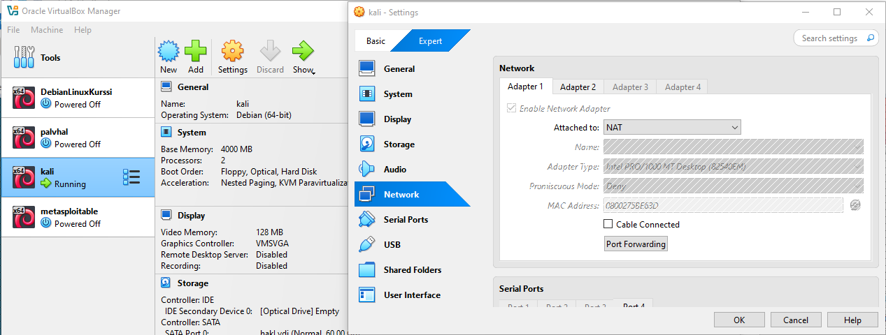
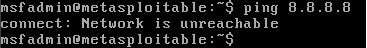

# h1 Kybertappoketju

Raportti on tehty 1.4.2025 - 2.4.2025 klo. 14.00 - 01.00 välisenä aikana.

Tehtävät on tehty Tero Karvisen Tunkeutumistestaus kurssin materiaaleja hyödyntäen.

Tehtävien tekemiseen käytetty laitteisto:

    Malli: Msi GE75 Raider 10sf
    OS: Windows 10 Home 64-bit
    RAM: 16 GB
    CPU: Intel(R) Core(TM) i7-10750H CPU @ 2.60GHz (12 CPUs), ~2.6GHz
    GPU: NVIDIA GeForce RTX 2070
    BIOS: E17E9IMS, 10A

## x) Tiivistelmä

### Herrasmieshakkerit

* Helpompi pitää huolta yhdestä tunnuksesta, kuin useasta maalaisjärkeä käyttäen.
* Bypit virtuaalivaluutta vaihtopalvelua kohtaan hyökättiin helmikuussa väitetysti pohjoiskorean toimesta. Isoin rahallinen menetys koskaan (1.5 miljardia dollaria).
* Valtiot härnäävät toisiaan avaruudessa ja yrittävät myös vakoilla toisten satelliitteja.
* 

### Intelligence-Driven Computer Network Defense
Informed by Analysis of Adversary Campaigns and
Intrusion Kill Chains

Intrusion Kill Chain on systemaattinen prosessi, millä kohdistetaan hyökkäys vihollista kohti. Pyritään saamaan haluttu effekti.
Vaiheet:
* 1. Reconnaissance - Kohteen tunnistus. Mihin hyökätään ja miten tämä voitaisiin toteuttaa
* 2. Weaponization - Yritetään saada etähallinta troijalainen muotoon, millä tämä saadaan uhrin järjestelmään. Esim. PDF tai microsoft office document. 
* 3. Delivery - Siirretään ase haluttuun ympäristöön. 3 yleiseintä tapaa on sähköposti, USB-laite ja sivustot.
* 4. Exploitation - Aseen ollessa järjestelmässä se laukeaa saastuttaen järjestelmän.
* 5. Installation - Asentaa etähallinta troijalaisen tai takaportin. Hyökkääjällä pääsy järjestelmään. 
* 6. Command and Control (C2) - Hyökkääjällä suora yhtes uhriin (etähallinta yhteys)
* 7. Actions on Objectives - Tässä vaiheessa hyökkääjä voi suorittaa teot saavuttaakseen päämääränsä.

### The Art of Hacking (Video Collection) 4.3 Surveying Essential Tools for Active Reconnaissance

#### Nmap - vakaa ja monipuolinen porttiskanneri
* "-sS" = TCP SYN scan, puoliavoin yheys saa vastauksen, jos portti on auki muttei palauta vastausta. Nopea ja yleinen skannaus.
* "-vv" = lisää verbositeettia, jotta tiedetään tarkemmin mitä skannaus tekee.
* "-T4" = lisää skannauksen nopeutta.
* "-A" = Os detection ja version detection. 

#### Masscan - nopein porttiskanneri
* Pystyy yhden portin kautta skannaamaan koko internetin 3 minuutissa

#### Udpprotoscanner - Nopea UDP porttiskanneri

#### EyeWitness - Voidaan etsiä nopeasti sivuja joiden kimppuun halutaan hyökätä
* Ottaa kuvakaappauksen, jonka perusteella voidaan päätellä halutaanko tähän hyökätä

### KKO 2003:36.

* A oli vuonna 1998 yrittänyt porttiskannata Osuuspankkikeskus-OPK osuuskunnan välityspalvelimet.
* Onnistuessaan A olisi voinut saada jatkoyhteyden internettiin, niin että yhteys oli näyttänyt tulleen pankin välityspalvelimesta.
* A todettiin syylliseksi ja korvausvelvolliseksi, mitä korkein oikeus ei valituksesta huolimatta muuttanut, vaikka A oli tapahtuma hetkellä alaikäinen.

## a) Kali

Kalin asentamisessa ei ilmeentynyt minkäänlaisia ongelmia. Asensin Kalin VM Virtualboxiin.

Komennolla "cat /etc/os-release" tarkistin käyttöjärjestelmän.

## b) Kalin irroitus verkosta

Oikealta yläreunasta löytyi valikko mistä pystyi sulkemaan verkkoyhteyden.

Karvisen materiaaleista löytyvällä "ping 8.8.8.8" komennolla pystyi varmistamaan, ettei verkkoon ole yhteyttä.

## c) Porttiskannaa 1000 tcp-porttia

Skannasin portit komennolla "nmap -T4 -A localhost". Komento löytyy Karvisen kurssimateriaaleista.

Parametrit:
* nmap = Verkkoskanneri
* -T4 = Asettaa nopeuden agressiiviseksi.
* -A = Käynnistää agressiivset ja edistyneet toiminteet mahdollistaen palveluiden ja käyttöjärjestelmän tunnistamisen
* localhost = paikallinenisäntä (oma laite)

Tuhat porttia skannattu localhostin osoitteella ja kaikki portit ovat suljettuna.

## d) Kaksi demonia

Apache ja ssh ovat valmiiksi asennettuna. Käynnistin nämä ja ajoin skannauksen uudeestaan.

Portit 22 (ssh) ja 80 (apache2) ovat auki.

## e) Metasploitable 2 virtuaalikoneeseen

Latasin metasploitable2 sivustolta: (https://sourceforge.net/projects/metasploitable/) Purin zipin ja noudatin seuraavalta sivustolta löytyviä metasploit2 asennus ohjeita: (https://www.geeksforgeeks.org/how-to-install-metasploitable-2-in-virtualbox/) Poikkeuksina asensin debianin ja annoin 2Gb ram-muistia 512Mb sijaan.

Pistin virtuaalikoneen käyttämään virtuaalista metasploitable2 kovalevyä minkä olin juuri ladannut. 

## f) Virtuaaliverkko koneiden välille

Tätä tehtäessä seurasin Tuomas Valkamon esimerkkiä: (https://tuomasvalkamo.com/PenTestCourse/week-2/)

Eli tein uuden Host-only networkin ja sallin DHCP:n

Host-only network päästiin tekemään seuraavasti: File -> Tools -> Network manager

Create -> default arvot ja Enable Server: on

Sitten laitoin kali-virtuaalikoneeseen seuraavat network asetukset

Network adapter 1 jätin NAT-asetuksen, jotta kali-koneella voi yhdistää verkkoon tarvittaessa. Kuvassa olen irroittanut "kaapelin", jotta sillä ei pääisisi verkkoon. 

Network adapter 2 kävin laittamssa Host-only Ethernet Adapter #2. Luulisin, että tätä adapteria ei olisi tarvinnut tehdä sillä VM VirtualBox Managerissa oli valmiina jo host-only adapteri, mutta epävarmuuttani tein uuden ja käytän sitten myös uutta.

Kävin myös säätämässä metasploitable-koneeen network adapteri 1:n kuuntelemaan Host-Only Etherent Adapter #2

Sitten testasin, että kalilla pääsee verkkoon.

Kuten näkyy pinggi toimii ja kesken ajon irroitin kaapelin, minkä jälkeen yhteys on katkennut.

Seuraavaksi käynnistin metasploit-koneen ja kirjauduin järjestelmään oletuskäyttäjänä

* Default login: msfadmin
* Default password: msfadmin

Suoritin ping 8.8.8.8 komennon tarkistaakseni, että onko yhteyttä verkkoon.

Ei ollut.

Tarkistin, että mikä on metasploit koneen IP-osoite komennolla "ip addr" Ja pingasin kali-koneella tätä osoitetta. Alkuun väitti ettei ole yhteyttä, käynnistin virtuaalikoneen uudestaan ja kokeilin ensiksi "ping 8.8.8.8" ja tämän jälkeen pingasin metasploit-koneen osoitetta.

Verkkoon ei yhteyttä, mutta koneiden välillä on yhteys.

## g) Etsi metasploitable

Tässä kokeilin sitten nmap skanneria parametrilla -sn. -sn on ping skanner ilman portti skannausta.

Eli kali-koneella ajoin komennon nmap -sn 192.168.69.3 (metasploit-koneen IP-osoite)

Laite on ylhäällä.

Ja selaimesta saa metasploit sivun auki laittamalla metasploit-koneen IP-osoitteen hakukenttään. Eli virtuaalikone metasploitable on löydetty.

## h) Porttiskannaa metasploitabale. Poimi 2-3 hyökkääjälle kiinnostavinta porttia. Analysoi ja selitä tulokset näiden porttien osalta.

Komennolla "nmap -A -T4 -p- 192.168.69.3" Skannassin metasploitable-koneen portit.

Ensimmäiseksi osui silmään portti 21/tcp

Anonymous FTP login allowed. Tämä tarkoittaa Geeks for Geeks sivuston mukaan sitä, että ulkopuoliset tahot voivat kirjautua FTP-palvelimelle ilman yksilöllistä tunnistautumista. Käyttäjä anonymous tai ftp ja salasana mikä tahansa. Tarkoittaa, että palvelut mitkä käyttävät FTP-protokollaa ei saa pitää sisällään salaista tietoa.

## Lähteet:

Karvinen, T. 2024: Tunkeutumistestaus. Luettavissa: (https://terokarvinen.com/tunkeutumistestaus/) Luettu 1.4.2025

Valkamo, T. 2022: Hacking into a Target Using Metasploit. Luettavissa: (https://tuomasvalkamo.com/PenTestCourse/week-2/) Luettu 1.4.2025

Geeks For Geeks: Check the OS Version in Linux. Luettavissa: (https://www.geeksforgeeks.org/how-to-check-the-os-version-in-linux/) Luettu 1.4.2025

Geeks For Geeks 2022: How to install Metasploitable 2 in VirtualBox. Luettavissa: (https://www.geeksforgeeks.org/how-to-install-metasploitable-2-in-virtualbox/) Luettu 1.4.2025

Geeks For Geeks 2021: What is Anonymous FTP (File Transfer Protocol)? Luettavissa: (https://www.geeksforgeeks.org/what-is-anonymous-ftp-file-transfer-protocol/) Luettu 2.4.2025

Nmap.org: Nmap Overview and Demonstration. Luettavissa: (https://nmap.org/book/nmap-overview-and-demos.html) Luettu 1.4.2025

sourceforge, rapid7user: Metasploitable. Luettavissa: (https://sourceforge.net/projects/metasploitable/) Luettu 1.4.2025

Hutchins, E. M., Cloppert, M. J., & Amin, R. M. 2011: Intelligence-Driven Computer Network Defense
Informed by Analysis of Adversary Campaigns and
Intrusion Kill Chains. Luettavissa: (https://lockheedmartin.com/content/dam/lockheed-martin/rms/documents/cyber/LM-White-Paper-Intel-Driven-Defense.pdf) Luettu 1.4.2025

Hyppönen, M., Tuominen, T. 2025: Herrasmieshakerit, Silmätaivaalla, vieraana Pekka Laurila | 0x37. Kuunneltavissa: (https://www.withsecure.com/fi/whats-new/podcasts/herrasmieshakkerit) Kuunneltu 1.4.2025

Santos, O., Taylor, R., Sternstein, J., McCoy, C. 2019: The Art of Hacking (Video Collection). Kuunneltavissa: (https://learning.oreilly.com/videos/the-art-of/9780135767849/9780135767849-SPTT_04_00/) Kuunneltu 1.4.2025

Korkein oikeus, 2003: KKO:2003:36. Luettavissa: (https://finlex.fi/fi/oikeuskaytanto/korkein-oikeus/ennakkopaatokset/2003/36) Luettu 1.4.2025

