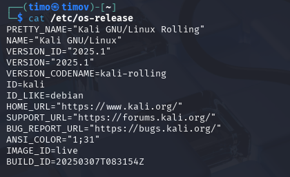

# h1 Kybertappoketju

## x) Tiivistelmä

## a) Kali

Kalin asentamisessa ei ilmeentynyt minkäänlaisia ongelmia. Asensin Kalin VM Virtualboxiin.

Komennolla "cat /etc/os-release" tarkistin käyttöjärjestelmän.

## b) Kalin irroitus verkosta

Oikealta yläreunasta löytyi valikko mistä pystyi sulkemaan verkkoyhteyden.

Karvisen materiaaleista löytyvällä "ping 8.8.8.8" komennolla pystyi varmistamaan, ettei verkkoon ole yhteyttä.

## c) Porttiskannaa 1000 tcp-porttia

Skannasin portit komennolla "nmap -T4 -A localhost". Komento löytyy Karvisen kurssimateriaaleista.

* nmap = Verkkoskanneri
* -T4 = Asettaa nopeuden agressiiviseksi.
* -A = Käynnistää agressiivset ja edistyneet toiminteet mahdollistaen palvelun ja käyttöjärjestelmän tunnistamisen
* localhost = paikallinenisäntä (oma laite)

Tuhat porttia skannattu 

## d) Kaksi demonia

## e) Metasploitable kahteen koneeseen

## f) Virtuaaliverkko koneiden välille

## g) Etsi metasploitable

## h) Porttiskannaa metasploitabale

## Lähteet:

Karvinen, Tero 2024: Tunkeutumistestaus. Luettavissa: (https://terokarvinen.com/tunkeutumistestaus/) Luettu 1.4.2025

Valkamo, Tuomas 2022: Hacking into a Target Using Metasploit. Luettavissa: (https://tuomasvalkamo.com/PenTestCourse/week-2/) Luettu 1.4.2025

Geeks For Geeks: Check the OS Version in Linux. Luettavissa: (https://www.geeksforgeeks.org/how-to-check-the-os-version-in-linux/) Luettu 1.4.2025

Nmap.org: Nmap Overview and Demonstration. Luettavissa: (https://nmap.org/book/nmap-overview-and-demos.html) Luettu 1.4.2025
