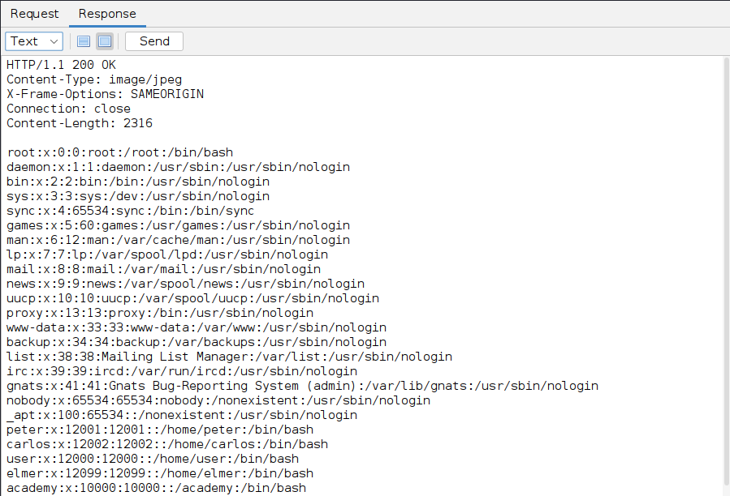
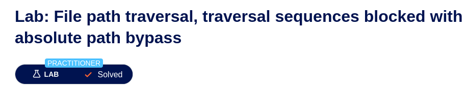

# h2 Täysin Laillinen Sertifikaatti

Raportti on tehty 8.4.2025 klo. 14.00 - 23.55 välisenä aikana.

Tehtävät on tehty Tero Karvisen Tunkeutumistestaus kurssin materiaaleja hyödyntäen. (https://terokarvinen.com/tunkeutumistestaus/)
Tehtävät suoritettu portswiggerin harjoitusympäristössä (https://portswigger.net/)

Tehtävien tekemiseen käytetty laitteisto:

Isäntäkone:

Malli: Msi GE75 Raider 10sf
OS: Windows 10 Home 64-bit
RAM: 16 GB
CPU: Intel(R) Core(TM) i7-10750H CPU @ 2.60GHz (12 CPUs), ~2.6GHz
GPU: NVIDIA GeForce RTX 2070
BIOS: E17E9IMS, 10A

Kali - VM virtualbox:

OS: Debian 64bit
RAM: 4 GB
CPU: Intel(R) Core(TM) i7-10750H CPU @ 2.60GHz (12 CPUs), ~2.6GHz (2 prosessoria käytössä)
Vram: 128 MB

## x) tiivistelmä

### OWASP 2021: OWASP Top 10:2021

A01:2021 – Broken Access Control

* Tarkoitus estää käyttäjiä tekemästä tekoja mihih heillä ei ole oikeuksia.
* Epäonnistuessa johtaa usein tietovuotoihin, datan muutoksiin ja datan tuhoutumiseen.

Keinoja puolustautua:
* Oleta, että kaikki on julkista. Eli kiellä pääsy oletuksena.
* Sisällytä pääsynhallinta mekanismi ja käytä sitä.

A10:2021 – Server-Side Request Forgery (SSRF)

* Haetaan tietoa etälähteistä.
* Tapahtuu, kun webbi-appi hakee tietoa ilman validointeja.

Keinoja puolustatua:
* Oleta, että kaikki on julkista. Eli kiellä pääsy oletuksena.
* Validoidaan syötteet, joilla tietoa haetaan.
* Ei palauteta käyttäjille "RAW" dataa

### PortSwigget Academy:

Insecure direct object references (IDOR)

* Pääsynhallinta haavoittuvuus
* Kun käytetään käyttäjän syöttämää syötettä suoraan hakuihin.

Keinoja puolustatua:

* Se, että tehdään asia epäselväksi ei takaa, että asia on turvassa.
* Jos tietoa ei tarvitse julkisesti jakaa, niin estä siihen pääsy.
* Testaa laajamittaisesti

Path traversal

* Muokataan polkua, jolla haetaan tietoa.
* Päästään käsiksi tietoihin mihin ei pitäisi päästä.

Keinoja puolustatua:

* Validointi, ei anneta käyttäjien muokata syötteitä. Eli haetaan tietoa vain tietyssä muodossa.
* Määritetään polku siten, että tieto haetaan aina tiettyä polkua pitkin.

Server-side request forgery (SSRF)

* Hyökkääjä suorittaa 3:nnen osapuolen kautta pyynnön, jota ei pitäisi pystyä toteuttamaan.
* Usein kohdistuu palvelun sisäisiin järjestelmiin.

Cross-site scripting

* Ujutetaan skripti sivustolle, jolla saadaan käyttäjille harmia aikaan.
* Voidaan esim. saadaa käyttäjien kirjautumistietoja jne.

Keinoja puolustatua:

* Validointi, rakennetaan "GET, PUT, POST jne." pyynnöt siten, että data lähtee muodossa, mikä ei aiheuta koodin ajamista.

## a) Totally Legit Sertificate ja b) kettumaista

Aloitin asentamalla zaproxyn kali-virtuaalikoneeseeni komennolla "sudo apt-get install zaproxy".
Käynnistin ohjelman komennolla "zaproxy"

Navigoin Karvisen vinkeistä löytyvien ohjeiden avulla zapissa: Tools -> Options -> Network -> Server Certificate (kävin samalla laittamassa täpän Tools -> Options -> Display Process images in HTTP requests/responses kohtaan, silä kuvia tarvitaan)

Seuraavaksi menin firefox selaimen Privacy & Security asetuksiin, josta avasin sertifikaatit "view certificates..."

Täältä import.

Tänne laitetaan juuri tallennettu sertifikaatti.

Seuraavaksi konfiguroin firefoxin käyttämään zappia proxynä. Firefoxin asetuksista general välilehdeltä löytyi alhaalta networksettings minne pääsi proxy osoitteen lisäämään.

Zapin dokumentaatiossa sanottiin, että yleensä localhost osoitteella mennään, joten tätä käytin (ip addr terminaaliin ja portti on 8080)
Firefox ei näköjään suostu tätä osoitetta käyttämään proxynä (lukee suoraan asetuksissa). Joten asensin tämän tehtävän yhteydessä myös foxyproxyn.

Firefoxista lisäosien kautta hain foxyproxyä ja asensin standard version.

Laitoin asetuksista samat proxy asetukset, kuin firefoxista eli localhost osoitteen. Lisäsin kanssa "proxy by patterniin" portswigger.net osoitteen, koska en halua käyttää proxyä muiden sivujen kautta (sekä Teron materiaaleissa näin lukee).

Sitten aktivoin proxy by patternsin.

Nyt proxy toimii vain portswiggerin kohdalla. Eli zappiin ei tule tietoa muista sivustoista. Testaan vielä.

Wikipedian avattua ei tule mitään uutta.

Portswigger ilmaantuu pyyntöihin. Eli nyt on zappi ja foxyproxy.

## PortSwigger labrat

### c) PortSwigger - Cross Site Scripting: Reflected XSS into HTML context with nothing encoded

Eli tässä tehtävässä ujutettiin skripti hakukenttään. Tehtävässä käytettiin alert skriptiä .

Hakukenttään ujutettu skripti.

Tulos. URL-osoitetta voi sitten lähtee esim. jakamaan, ja uhrit jotka tämän avaavat suorittavat skriptin. Tässä tapauksessa näkevät varoituksen superpahasta viruksesta.

Valmis.

### d) PortSwigger - Cross Site Scripting: Stored XSS into HTML context with nothing encoded

Eli tässä tehtävässä ujutettiin skripti blogin kommentti kenttään. Tämän jälkeen jokainen, joka sivun avaa suorittaa kommenttikenttään ujutetun skriptin vaikkei näin haluaisi. Hakukentän pitäisi muuttaa syötetty teksti harmottomaan muotoon.

Tehtävässä ujutettiin seuraava skripti: ""

Tämän pystyi tänne laittamaan, koska kommenttikentän syötteitä ei mitenkään kontrolloida. Eli kommentit pitäisi muuttaa muotoon miten näitä ei ajettaisi skriptinä.

Labra suoritettu.

### e) PortSwigger - Path Traversal: File path traversal, simple case

Tässävaiheessa huomasin, että zap ei ota mm. kuvia vastaan. Kävin muuttamassa foxyproxyn asetuksia. (sain siis vain 100 alkuista liikennettä. Portswiggeristä siirtymä labraan) 

Nyt pitäisi liikenteem tulla labroista sekä localhostista (saattaa tarvita myöhemmin), sillä labrat ovat "web-security-academy.net" osoitteen takana. Poistin samalla portswiggerin, koska minun ei tarvitse seurata täältä tulevaa liikennettä.

Nyt tulee labrasta liikenne zappiin mitä tehtävässä tarvitsee. Eli tehtävässä piti syöttää get pyyntöön kuvatiedoston tilalle polku passwd (oletetttavasti salasanoja) kansioon.

Oikealla korvalla rivi 54 auki ja "open/resend with request editor"

Maalattuun kohtaan lisäsin kuvan osoittaman polun "../../../etc/passwd" Eli hakee nyt pyyntö tiedostoa "passwd" hakemistosta "etc/". "../" vastaa "cd .." komentoa, eli liikutaan lähemmäs root polkua ( / ). Eli, jos kolme "../" ei riitä tänne pääsemiseen, niin lisätään "../" pätkiä.  

Responseen tulostui alla oleva. Pyyntö mennyt läpi "200 OK". Content-Type: image/jpeg, selvästi.

En suoraan tulosteesta osaa sanoa, että mikä kohta on salasana, mutta en usko, että näitä halutaan jokaisen nähtäväksi kuitenkaan.

Labra läpi.

### f) PortSwigger - Path Traversal: File path traversal, traversal sequences blocked with absolute path bypass

Tässä tehtävässä hyökättiin samaa haavoittuvaisuutta kohtaan. Erona oli ettei nyt varsinaisesti suoritettu path traversalia, vaan nyt kysyttiin tiedostoa suoraan "/etc/passwd" polusta.

Samalla tapaan, kun terminaalista voi omasta hakemistosta tarkastella "/etc/" sisältöä, jos on oikeudet tähän.

Eli labrasta avattiin tuote (valitsin babbage web sprayn)

Zapista taas etsin pyynnön, jossa haetaan kuvaa.

"filename=22.jpg" korvataan "filename=/etc/passwd" Responseen tulostui samanlainen syöte, kun aiemmassa tehtävässä.

Labra valmis. 

### g) PortSwigger - Path Traversal: File path traversal, traversal sequences stripped non-recursively

Tässä avattiin labra ja samalla tapaan tarkasteltiin tuotetta. Zapista etsittiin taas pyyntö, jossa haetaan kuvaa ja muokattiin kohtaa "filename=".

Dokumentaatiossa sanotaan näin. "You might be able to use nested traversal sequences, such as ....// or ....\/. These revert to simple traversal sequences when the inner sequence is stripped." (https://portswigger.net/web-security/file-path-traversal#what-is-path-traversal) En ymmärrä mitä tämä tekee.

Eli labra saatiin tehdyksi muokkaamalla "filename=" muotoon "filename=....//....//....//etc/passwd"

Ylla taas zapin manual request editor, jossa näkyy muokattu rivi.

Labra valmis.

### h) PortSwigger - Insecure Direct Object Reference (IDOR): Insecure direct object references

Tässä haetaan käyttäjän salasanatietoja. Eli labrassa tarkastettiin, että miten live chatti tallettaa keskustelut ja käytettiin tätä hyödyksi.

Eli käytin avaamassa keskustelu ja klikattiin "view transcript"

zapista etsittiin tämä ja kuten näkyy, niin transcripti on muotoa "2.txt" mistä voi päätellä, että on olemassa "1.txt". Joten hain "1.txt" kuvan osoittamalla tavalla.

Vastauksena tulee salasana, minkä kopioin. Menin "my account" välilehdelle ja käyttäjäksi "carlos" salasana "copy-paste"

Labra valmis.

### i) PortSwigger - Server Side Request Forgery (SSRF): Basic SSRF against the local server

Labrassa avasin tuotteen ja klikkasin alhaalta löytyvää "check stock" painiketta.

Zapilla tutkailin pyyntöä.

stockApi lähtee http protokollaa käyttäen. Laitoin tähän tuon "http://localhost/admin".

Sitten katsotaan response.

Eli komennolla "/admin/delete?username=carlos" pitäisi Carloksen kadota. Kokeillaan

Käydään katsomassa response uudestaan.

"User deleted successfully"

Labra läpi

## Lähteet:

Karvinen, T. 2024: Tunkeutumistestaus. Luettavissa: (https://terokarvinen.com/tunkeutumistestaus/) Luettu 8.4.2025

OWASP Top 10:2021: A01:2021 – Broken Access Control. Luettavissa: (https://owasp.org/Top10/A01_2021-Broken_Access_Control/) Luettu 8.4.2025

OWASP Top 10:2021: A10:2021 – Server-Side Request Forgery (SSRF). Luettavissa: (https://owasp.org/Top10/A10_2021-Server-Side_Request_Forgery_%28SSRF%29/) Luettu 8.4.2025

PortSwigger: Insecure direct object references (IDOR). Luettavissa: (https://portswigger.net/web-security/access-control/idor) Luettu 8.4.2025

PortSwigger: Path traversal. Luettavissa (https://portswigger.net/web-security/file-path-traversal) Luettu 8.4.2025

PortSwigger: Server-side request forgery (SSRF). Luettavissa (https://portswigger.net/web-security/ssrf) Luettu 8.4.2025

PortSwigger: Cross-site scripting. Luettavissa (https://portswigger.net/web-security/cross-site-scripting) Luettu 8.4.2025

Zap by checkmarx: Configuring Proxies. Luettavissa: (https://www.zaproxy.org/docs/desktop/start/proxies/) Luettu 8.4.2025
