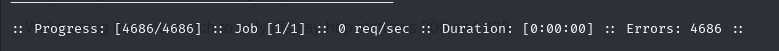
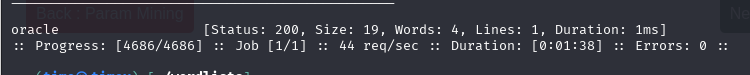
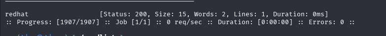

# h3 fuzzy

Raportti on tehty 15.4.2025-16.4.2025 klo. 14.30 - 00.30 välisenä aikana.

Tässä raportissa tehdyt tehtävät ovat osana Tero Karvisen tunkeutumistestaus kurssia. Materiaalit ovat luettavissa osoitteessa: (https://terokarvinen.com/tunkeutumistestaus/).

Tehtävien tekemiseen käytetty laitteisto:

Isäntäkone:

Malli: Msi GE75 Raider 10sf OS: Windows 10 Home 64-bit RAM: 16 GB CPU: Intel(R) Core(TM) i7-10750H CPU @ 2.60GHz (12 CPUs), ~2.6GHz GPU: NVIDIA GeForce RTX 2070 BIOS: E17E9IMS, 10A

Kali - VM virtualbox:

OS: Debian 64bit RAM: 4 GB CPU: Intel(R) Core(TM) i7-10750H CPU @ 2.60GHz (12 CPUs), ~2.6GHz (2 prosessoria käytössä) Vram: 128 MB

## x) Tiivistelmä

### Karvinen 2023: [Find Hidden Web Directories - Fuzz URLs with ffuf](https://terokarvinen.com/2023/fuzz-urls-find-hidden-directories/)

fuffin asennus packetmanagerilla:

    $ sudo apt-get update
    $ sudo apt-get install ffuf

Parametreja:

* (HTTP) Status (-fc). But the hidden pages are probably 200 OK, too.
* Size (in bytes) (-fs)
* Words (-fw)
* Lines (-fl)

### Hoikkala 2023: [ffuf README.md](https://github.com/ffuf/ffuf/blob/master/README.md)

* -maxtime 5 = fussataan 5 sekuntia
* FUZZ jälkeen voi laittaa useita parametreja. esim. "FUZZ -mc all -fc 400" Haetaan kaikki muut status responset paitsi 400. 

GET fuss

    ffuf -w /path/to/values.txt -u https://target/script.php?valid_name=FUZZ -fc 401

* -W = sanalistan sijainti
* -u = url josta haetaan

POST fuss

    ffuf -w /path/to/postdata.txt -X POST -d "username=admin\&password=FUZZ" -u https://target/login.php -fc 401

* -X HTTP metodi (POST)
* -d POST data

## a) Fuzzzz. Ratkaise dirfuz-1 artikkelista Karvinen 2023: [Find Hidden Web Directories - Fuzz URLs with ffuf](https://terokarvinen.com/2023/fuzz-urls-find-hidden-directories/)

Aloitin tekemällä dirfuzt-0:n ensiksi ja tämän jälkeen siirryin dirfuzt-1.

Molempia tehtäviä tehdessä käytin "common.txt" nimistä sanalistaa, jonka sai wgetillä seuraavasti:

    wget https://raw.githubusercontent.com/danielmiessler/SecLists/master/Discovery/Web-Content/common.txt

Latasin dirfuzt-1:n komennolla: 

    wget https://terokarvinen.com/2023/fuzz-urls-find-hidden-directories/dirfuzt-1

Tämän jälkeen sammutin dirfuzt-0 (ctrl+c terminaaliin missä tämä käynnissä). Annoin käyttäjälle suoritus oikeudet dirfuzt-1 komennolla:

    chmod u+x dirfuzt-1

Käynnistin dirfuzt-1:n komennolla:

    ./dirfuzt-1

Sitten avasin selaimesta dirfuzti-1:n ja irroitin koneen verkosta.

* ping 8.8.8.8 - pinggaa googlen julkista dns palvelinta.

Seuraavaksi kokeilin fuzzata commont.txt sanalistan kanssa ilman muita parametreja dizfuzt-1:tä komennolla:

    ffuf -w common.txt -u http://127.0.0.2:8000/FUZZ

Aikaisemmin listaa suodatettiin koon perusteella, joten lähdin tässä tekemään samaa. Listassa oli paljon tiedostoja joiden kokona oli 154 tavua, joten suodatin nämä pois seuraavasta hausta komennolla:

    ffuf -w common.txt -u http://127.0.0.2:8000/FUZZ -fs 154

Punaisella alleviivattu "wp-admin" varmaan on adminpaneeli ja .git alkuiset päätteet viittavat versionhallintaan. Katsoin curlilla mitä näistä löytyy.

    curl 127.0.0.2:8000/wp-admin
    curl 127.0.0.2:8000/.git
    curl 127.0.0.2:8000/.git/logs

Adminin kohdalta lippu löytyikin. Versionhallinta .git, ei tuottanut tulosta, joten kokeilin /logs, koska täältä pitäisi nähdä versionhallinnan historia. Ja täältä tulikin lippu esille.

## b) Fuff me. Asenna FuffMe-harjoitusmaali. [Karvinen 2023: Fuffme - Install Web Fuzzing Target on Debian](https://terokarvinen.com/2023/fuffme-web-fuzzing-target-debian)

Asentelin Karvisen ohjeiden mukaan harjoitusmaalin ja latasin sanalistat.

Vaatimusten asentelu ffufme:lle ja ffuf:lle

    $ sudo apt-get update
    $ sudo apt-get install docker.io git ffuf

Harjoitusmaalille docker säilö

    $ git clone https://github.com/adamtlangley/ffufme
    $ sudo docker build -t ffufme .

* docker build pitää laittaa hakemistoon /ffufme
    
Harjoitusmaalin ajaminen

    $ sudo docker run -d -p 80:80 ffufme

Sanalistojen lataaminen wgetillä

    $ wget http://ffuf.me/wordlist/common.txt
    $ wget http://ffuf.me/wordlist/parameters.txt 
    $ wget http://ffuf.me/wordlist/subdomains.txt

* tein sanalistoille oman hakemiston (/wordlists) minne nämä kävin hakemassa.
    
Suljin apache2:n

    sudo systemctl disable --now apache2.service

sekä otin foxyproxyn pois käytöstä sillä ei ffuf.me muuten näkynyt.

Valmiina aloittamaan.

## c) Basic Content Discovery

Aloitin varmistamalla, että en ole enään verkossa kali-virtuaalikoneellani.

    ping 8.8.8.8

Vatauksena "Network unreachable". Eli pystyin aloittamaan fuzzailun hyvällä omatunnolla.

Eli piti löytää class ja developement.log komennolla:

    ffuf -w ~/wordlists/common.txt -u http://localhost/cd/basic/FUZZ

* -w = haetaan sanalista
* Sanalista "common.txt" haetaan "wordlists" hakemistosta.
* -u = kohde url
* /FUZZ = lets fuzz

Nehän löytyi.

## d) Content Discovery With Recursion

Tässä sitten etsittiin admin-oikeuksia komennolla:

    ffuf -w ~/wordlists/common.txt -recursion -u http://localhost/cd/recursion/FUZZ

* -recursion = hakee kansioita kansion sisältä kunnes kansiota ei enään löydy. 

Tässä näkyy näin käyneen. Eli kansion "admin" sisältä on löytynyt "users" kansio ja tämän sisältä "96". Curlilla vielä tarkastin pathin "localhost/cd/recursion/admin/users/96" ja löysin tiedoston.

Näitä sanoja fuffi etsii sanalistan avulla, eli käytössä olevasta sanalistasta pitää kyseiset sanat löytyä.
Tarkistin tämän navigoimalla "/wordlists" hakemistoon ja greppiä hyödyntäen hain näitä sanoja "common.txt" tiedostosta.

admin riviltä 509

96 riviltä 178

users riviltä 4312

Etsin nimenomaan ffufme:tä varten ladatusta "common.txt" tiedostosta näitä, koska tämä on se mitä olen käyttänyt fuffia käytettäessä. 

## e) Content Discovery With File Extensions

Tässä käytettiin file extensionia komennolla:

    ffuf -w ~/wordlists/common.txt -e .log -u http://localhost/cd/ext/logs/FUZZ

* -e = laajentaa fuzzin hakuparametria
* .log = laajennus. Eli tämä lisätään jokaisen sanan perään sanalistalla. esim. admin.log, users.log tai 96.log
* Hakuhan suoritetaan hakemistoon "/cd/ext/logs/FUZZ". Eli tässä oletetaan, että haluttu ".log" tiedosto löytyy juuri täältä.

Sieltähän löytyi "users.log"

## f) No 404 Status

Tässä harjoituksessa ajettiin komento:

    ffuf -w ~/wordlists/common.txt -u http://localhost/cd/no404/FUZZ

Tulostetta tutkiessa näki, että  arvot status "200", Size "669 tavua" Words "126" ja Lines "23" toistuvat useasti. Eli voi päätellä, että näiden tiedostojen sisältä ei löydy haluttua sisältöä, joten suodatetaan nämä pois "-fs" parametrilla.

Harjoituksessa suodatettiin size parametrin perusteella:

    ffuf -w ~/wordlists/common.txt -u http://localhost/cd/no404/FUZZ -fs 669

* Jos tuhannesta tiedostosta yksi on koonsa puolesta eroava, niin on hyvä miettiä, että miksi.
  

Löytyi secret tiedosto, jonka statuksena "200". Eli responsea ei tässä olisi voinut käyttää hyödyksi, mutta muita parametreja durationia lukuunottamatta kyllä (durationissa liikaa vaihtelua).

* -fw 126  # Suodattaa sanamäärän perusteella
* -fl 23   # Suodattaa rivimäärän perusteella

Pointti tässä oli, että sivusto ei palauta 404 (not found) statusta, eli tämän perusteella ei voi salattua sivua löytää. 

## g) Param Mining

Nyt etsittiin kadoksissa olevaa parametria komennolla:

    ffuf -w ~/wordlists/parameters.txt -u http://localhost/cd/param/data?FUZZ=1

* käytetään sanalistaa "parameters.txt"
* FUZZ=1 en osaa sanoa mitä tekee, kun on sama tulos tulee "FUZZ", "FUZZ=2" tai "FUZZ=3"

Puuttuva parametri "debug" Tällä pitäisi sitten saada sivu näkyviin. Tarkastin curlilla miltä näyttää.

    curl localhost/cd/param/data
    curl localhost/cd/param/data/debug
    

Alkuun tuli "Required Parameter Missing" ja "debugin" kanssa aukesikin sivu mitä ei pitäisi auki saada.

## h) Rate Limited

Tässä sitten yritetään ohittaa rate limitti. Eli tässä on asetuksena ettei voida lähettää enempää, kuin 50 pyyntöä sekunnissa.  Ensiksi testatiin rajoittamatonta hakua:

    ffuf -w ~/wordlists/common.txt -u http://ffuf.test/cd/rate/FUZZ -mc 200,429

* -mc = haetaan vastaavia status responseja "200, 429" 

Tuli reilusti virheitä. Harjoituksessa lukee, että pitäisi kuitenkin saada näitä 429 responseja. Tiedä sitten. Kokeilin kuitenkin rajoittaa pyyntöjen nopeutta komennolla:

    ffuf -w ~/wordlists/common.txt -t 5 -p 0.1 -u http://ffuf.test/cd/rate/FUZZ -mc 200,429

* -t 5 = threadejen määrä. Normaalisti 40 asetetaan 5. fuff instanssejen määrä? Jokatapauksessa mitä suurempi luku, niin sen enemmän pyyntöjä lähtee.
* -p 0.1 = Pyyntöjen välinen viive. 0.1 sekuntia.
* Näillä asetuksilla pitäisi olla alle 50 pyyntöä sekunnissa.

Vieläkään ei mitään. Ahaa vika onkin url-osoitteessa. Eli tässä yritetään tehdä pyyntöä osoitteeseen "ffuf.test", mutta minulla tämä on localhostissa, joten teen pyynnön localhostiin.

    ffuf -w ~/wordlists/common.txt -t 5 -p 0.1 -u http://localhost/cd/rate/FUZZ -mc 200,429

Noniin löytyihän se oraakkeli. 

Ja ilman rajoittimia tuli sitten paljon status 429 responseja.

    ffuf -w ~/wordlists/common.txt -u http://localhost/cd/rate/FUZZ -mc 200,429

## i) Subdomains - Virtual Host Enumeration

Nyt etsitään alidomaineja. Ensiksi etsittiin komennolla:

    ffuf -w ~/wordlists/subdomains.txt -H "Host: FUZZ.ffuf.me" -u http://localhost

* -H = etsitään headeria. Tässä tapauksessa kohdasta "Host: "FUZZ".

Mikäs se sielä pilkistää "redhat" eroaa joukosta (pitäisi varmaan lotota, kun vahingossa löytyi)

Suodaettiin jokatapauksessa useasti toistuva bittimäärä pois komennolla:

    ffuf -w ~/wordlists/subdomains.txt -H "Host: FUZZ.ffuf.me" -u http://localhost -fs 1495

Sinne se redhatti sitten suodatettiin.

## Lähteet:

T. Karvinen 2025: Tunkeutumistestaus. Luettavissa: (https://terokarvinen.com/tunkeutumistestaus/) Luettu 15.4.2025

T. Karvinen 2023: Find Hidden Web Directories - Fuzz URLs with ffuf. Luettavissa: (https://terokarvinen.com/2023/fuzz-urls-find-hidden-directories/) Luettu 15.4.2025

T. Karvinen 2023: Fuffme - Install Web Fuzzing Target on Debian. Luettavissa: (https://terokarvinen.com/2023/fuffme-web-fuzzing-target-debian/) Luettu 15.4.2025

J. Hoikkala 2023: ffuf - Fuzz Faster U Fool. Luettavissa: (https://github.com/ffuf/ffuf/blob/master/README.md) Luettu 15.4.2025

