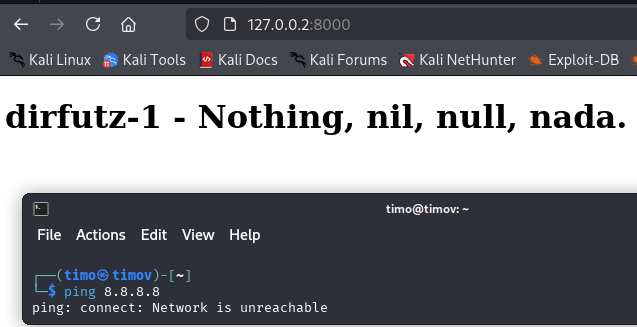

# h3 fuzzy

Raportti on tehty 15.4.2025 klo. 14.30 - välisenä aikana.

Tässä raportissa tehdyt tehtävät ovat osana Tero Karvisen tunkeutumistestaus kurssia. Materiaalit ovat luettavissa osoitteessa: (https://terokarvinen.com/tunkeutumistestaus/).

Tehtävien tekemiseen käytetty laitteisto:

Isäntäkone:

Malli: Msi GE75 Raider 10sf OS: Windows 10 Home 64-bit RAM: 16 GB CPU: Intel(R) Core(TM) i7-10750H CPU @ 2.60GHz (12 CPUs), ~2.6GHz GPU: NVIDIA GeForce RTX 2070 BIOS: E17E9IMS, 10A

Kali - VM virtualbox:

OS: Debian 64bit RAM: 4 GB CPU: Intel(R) Core(TM) i7-10750H CPU @ 2.60GHz (12 CPUs), ~2.6GHz (2 prosessoria käytössä) Vram: 128 MB

## x) Tiivistelmä

### Karvinen 2023: Find Hidden Web Directories - Fuzz URLs with ffuf

### Hoikkala 2023: ffuf README.md

## a) Fuzzzz. Ratkaise dirfuz-1 artikkelista Karvinen 2023: [Find Hidden Web Directories - Fuzz URLs with ffuf](https://terokarvinen.com/2023/fuzz-urls-find-hidden-directories/)

Aloitin tekemällä dirfuzt-0:n ensiksi ja tämän jälkeen siirryin dirfuzt-1.

Molempia tehtäviä tehdessä käytin "common.txt" nimistä sanalistaa, jonka sai wgetillä seuraavasti:

    wget https://raw.githubusercontent.com/danielmiessler/SecLists/master/Discovery/Web-Content/common.txt

Latasin dirfuzt-1:n komennolla: 

    wget https://terokarvinen.com/2023/fuzz-urls-find-hidden-directories/dirfuzt-1

Tämän jälkeen sammutin dirfuzt-0 (ctrl+c terminaaliin missä tämä käynnissä). Annoin käyttäjälle suoritus oikeudet dirfuzt-1 komennolla:

    chmod u+x dirfuzt-1

Käynnistin dirfuzt-1:n komennolla:

    ./dirfuzt-1

Sitten avasin selaimesta dirfuzti-1:n ja irroitin koneen verkosta.

* ping 8.8.8.8 - pinggaa googlen julkista dns palvelinta.

Seuraavaksi kokeilin fuzzata commont.txt sanalistan kanssa ilman muita parametreja dizfuzt-1:tä komennolla:

    ffuf -w common.txt -u http://127.0.0.2:8000/FUZZ

Aikaisemmin listaa suodatettiin koon perusteella, joten lähdin tässä tekemään samaa. Listassa oli paljon tiedostoja joiden kokona oli 154 bittiä, joten suodatin nämä pois seuraavasta hausta komennolla:

    ffuf -w common.txt -u http://127.0.0.2:8000/FUZZ -fs 154

Punaisella alleviivattu "wp-admin" varmaan on adminpaneeli ja .git alkuiset päätteet viittavat versionhallintaan. Katsoin curlilla mitä näistä löytyy.

    curl 127.0.0.2:8000/wp-admin
    curl 127.0.0.2:8000/.git
    curl 127.0.0.2:8000/.git/logs

Adminin kohdalta lippu löytyikin. Versionhallinta .git, ei tuottanut tulosta, joten kokeilin /logs, koska täältä pitäisi nähdä versionhallinnan historia. Ja täältä tulikin lippu esille.

## b) Fuff me. Asenna FuffMe-harjoitusmaali. [Karvinen 2023: Fuffme - Install Web Fuzzing Target on Debian](https://terokarvinen.com/2023/fuffme-web-fuzzing-target-debian)

## c) Basic Content Discovery

## d) Content Discovery With Recursion

## e) Content Discovery With File Extensions

## f) No 404 Status

## g) Param Mining

## h) Rate Limited

## i) Subdomains - Virtual Host Enumeration

## Lähteet:

T. Karvinen 2025: Tunkeutumistestaus. Luettavissa: (https://terokarvinen.com/tunkeutumistestaus/) Luettu 15.4.2025

T. Karvinen 2023: Find Hidden Web Directories - Fuzz URLs with ffuf. Luettavissa: (https://terokarvinen.com/2023/fuzz-urls-find-hidden-directories/) Luettu 15.4.2025

T. Karvinen 2023: Fuffme - Install Web Fuzzing Target on Debian. Luettavissa: (https://terokarvinen.com/2023/fuffme-web-fuzzing-target-debian/) Luettu 15.4.2025

J. Hoikkala 2023: ffuf - Fuzz Faster U Fool. Luettavissa: (https://github.com/ffuf/ffuf/blob/master/README.md) Luettu 15.4.2025

