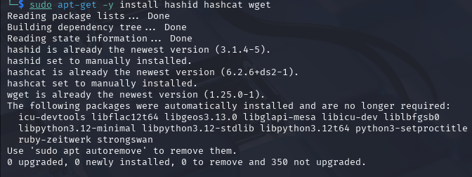

# h4 Leviämässä

Raportti on tehty 22.4.2025  klo. 15.30 - .

Tässä raportissa tehdyt tehtävät ovat osana Tero Karvisen tunkeutumistestaus kurssia. Materiaalit ovat luettavissa osoitteessa: (https://terokarvinen.com/tunkeutumistestaus/).
 
## x) tiivistelmä

### Karvinen 2022: [Cracking Passwords with Hashcat](https://terokarvinen.com/2022/cracking-passwords-with-hashcat/)

* Järjestelmät ei tallenna alkuperäisiä salasanoja, vaan hashin.
* Tietokoneella voidaan yrittää löytää hashia vastaava sana. 
* Pen-testit oletuksena laittomia ilman sopimuksia.

Hashcatin asennus:

    sudo apt-get -y install hashid hashcat wget

* Pitää tehdä hakemisto minne tallennetatan hashcatilla tuotettu data.
* Täyyy hankkia iso sanakirjasto (Rockyou suosittu)
* Tunnista hashin tyyppi. MD5 yleisempi, kuin MD2 tai MD4

### Karvinen 2023: [Crack File Password With John](https://terokarvinen.com/2023/crack-file-password-with-john/)

### € Santos et al 2017: Security Penetration Testing - The Art of Hacking Series LiveLessons: [Lesson 6: Hacking User Credentials](https://learning.oreilly.com/videos/security-penetration-testing/9780134833989/9780134833989-sptt_00_06_00_00) (8 videos, about 30 min)

### € Kennedy et al 2025: Metasploit: [File-Format Exploits](https://learning.oreilly.com/library/view/metasploit-2nd-edition/9798341620032/xhtml/chapter9.xhtml#:-:text=File-Format%20Exploits) (sivun loppuun, eli Wrapping Up loppuun)

### € Singh 2025: The Ultimate Kali Linux Book: [Understanding Active Directory](https://learning.oreilly.com/library/view/the-ultimate-kali/9781835085806/Text/Chapter_12.xhtml#_idParaDest-272) (Vain tuo kappale, ei enää "Enumerating Active Directory")

### € Vapaaehtoinen: Kennedy et al 2025: Metasploit: [Basic Meterpreter Commands](https://learning.oreilly.com/library/view/metasploit-2nd-edition/9798341620032/xhtml/chapter6.xhtml#toc-link_85)

## a) Asenna Hashcat ja testaa sen toiminta murtamalla esimerkkisalasana.

Lähdin asentelemaan hashcattia Tero Karvisen [ohjeita](https://terokarvinen.com/2022/cracking-passwords-with-hashcat/) noudattaen.
Asensin hashcatin, hashidin ja wgetin komennolla:

    sudo apt-get -y install hashid hashcat wget

Kaikki nämä olivatkin jo entuudestaan asennettuna. Seuraavaksi tein hakemiston hashed minne lisään sanakirjan ja hashcatin tuottaman sisällön. Sanakirjan latasin, purin ja poistin seuraavilla komennoilla:

    $ wget https://github.com/danielmiessler/SecLists/raw/master/Passwords/Leaked-Databases/rockyou.txt.tar.gz
    $ tar xf rockyou.txt.tar.gz
    $ rm rockyou.txt.tar.gz

* tar = paketointi työkalu (winzipin kaltainen)
* x = pura
* f = tiedosto (file)
* gz = zippi ymmärtääkseni (pakattu tiedosto)

Eli wgetilla haettiin sanalista. Tarilla purettiin sanalista ja sitten rm komennolla poistettiin zippi.

Sitten lähdin murtamaan seuraavaa esimerkkisalasanaa:

    6b1628b016dff46e6fa35684be6acc96

Sitten tarkistin, että mitä vaihtoehtoja hashin murtamiseen löytyy komennolla:

    hashid -m 6b1628b016dff46e6fa35684be6acc96

Listassa näyttäisi olevan useita vaihtoehtoja, joilla hashia voisi työstää. Karvisen mukaan oikea vaihtoehto löytyy yleensä, top-3:sta.

Top-3:

* MD2
* MD5
* MD4

Karvisen mukaan näistä yleisin on MD5. Joten lähdin tätä ensimmäisenä kokeilemaan komennolla:

     hashcat -m 0 '6b1628b016dff46e6fa35684be6acc96' rockyou.txt -o solved

* -m 0 = valitaan mode. 0, koska MD5 "hashcat mode: 0"
* rockyou.txt = sanakirja, jolla murretaan.
* -o solved = tallentaa tuloksen "solved" nimellä.

Hakemistoon "hashed" on ilmaantunut solved niminen tiedosto. En tiedä miten tässä onnistuin, mutta käytin hashcatin sijasta hashidia. Catilla ($ cat solved) , kun yritti tarkastaa solvedia, niin syöte oli seuraava.

Tämä ei kyllä auta salasananmurtamisessa mitenkään, joten yritetään nyt sitten tehdä sama hashcatilla. Olisi varmaan tiedosto nimi pitänyt muuttaa, kun solved tiedosto catilla tuotti saman tulosteen. 

* hash crackattu

Crackaus kuitenkin onnistui ja vastauksen sain komennolla:

    $ hashcat -m 0 6b1628b016dff46e6fa35684be6acc96 rockyou.txt --show

Ja hashia vastaava sana on "summer". Esimerkkisalasana murrettu.

## c) Asenna John the Ripper ja testaa sen toiminta murtamalla jonkin esimerkkitiedoston salasana.

## e) Tiedosto. Tee itse tai etsi verkosta jokin salakirjoitettu tiedosto, jonka saat auki. Murra sen salaus. (Jokin muu formaatti kuin aiemmissa alakohdissa kokeilemasi).

## f) Tiiviste. Tee itse tai etsi verkosta salasanan tiiviste, jonka saat auki. Murra sen salaus. (Jokin muu formaatti kuin aiemmissa alakohdissa kokeilemasi. Voit esim. tehdä käyttäjän Linuxiin ja murtaa sen salasanan.)

## g) Tee msfvenom-työkalulla haittaohjelma, joka soittaa kotiin (reverse shell). Ota yhteys vastaan metasploitin multi/handler -työkalulla.

## Lähteet:

T. Karvinen 2025: Tunkeutumistestaus. Luettavissa: (https://terokarvinen.com/tunkeutumistestaus/) Luettu 22.4.2025

T. Karvinen 2022: Cracking Passwords with Hashcat. Luettavissa: (https://terokarvinen.com/2022/cracking-passwords-with-hashcat/) Luettu 22.4.2025

T. Karvinen 2023: Crack File Password With John. Luettavissa: (https://terokarvinen.com/2023/crack-file-password-with-john/) Luettu 22.4.2025

Stack Overflow 2016: Viestiketju, difference between tar zxf vs -xvf. Luettavissa: (https://stackoverflow.com/questions/35612534/difference-between-tar-zxf-vs-xvf#35613601) Luettu 22.4.2025
