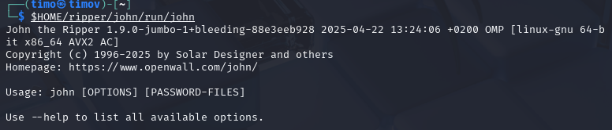

# h4 Leviämässä

Raportti on tehty 22.4.2025  klo. 15.30 - .

Tässä raportissa tehdyt tehtävät ovat osana Tero Karvisen tunkeutumistestaus kurssia. Materiaalit ovat luettavissa osoitteessa: (https://terokarvinen.com/tunkeutumistestaus/).
 
## x) tiivistelmä

### Karvinen 2022: [Cracking Passwords with Hashcat](https://terokarvinen.com/2022/cracking-passwords-with-hashcat/)

* Järjestelmät ei tallenna alkuperäisiä salasanoja, vaan hashin.
* Tietokoneella voidaan yrittää löytää hashia vastaava sana. 
* Pen-testit oletuksena laittomia. Eli ei saa luvatta testailla ulkopuolisten järjestelmiä.

Hashcatin asennus:

    sudo apt-get -y install hashid hashcat wget

* Pitää tehdä hakemisto minne tallennetatan hashcatilla tuotettu data.
* Täyyy hankkia iso sanakirjasto (Rockyou suosittu)
* Tunnista hashin tyyppi. MD5 yleisempi, kuin MD2 tai MD4

### Karvinen 2023: [Crack File Password With John](https://terokarvinen.com/2023/crack-file-password-with-john/)

* Monet tiedostotyypit vahvistavat salausta salasanalla.
* John the Ripperilla voidaan crackata nämä salasanat käyttäen sanakirjahyökkäystä.

### € Santos et al 2017: Security Penetration Testing - The Art of Hacking Series LiveLessons: [Lesson 6: Hacking User Credentials](https://learning.oreilly.com/videos/security-penetration-testing/9780134833989/9780134833989-sptt_00_06_00_00) (8 videos, about 30 min)

### € Kennedy et al 2025: Metasploit: [File-Format Exploits](https://learning.oreilly.com/library/view/metasploit-2nd-edition/9798341620032/xhtml/chapter9.xhtml#:-:text=File-Format%20Exploits) (sivun loppuun, eli Wrapping Up loppuun)

### € Singh 2025: The Ultimate Kali Linux Book: [Understanding Active Directory](https://learning.oreilly.com/library/view/the-ultimate-kali/9781835085806/Text/Chapter_12.xhtml#_idParaDest-272) (Vain tuo kappale, ei enää "Enumerating Active Directory")

## a) Asenna Hashcat ja testaa sen toiminta murtamalla esimerkkisalasana.

Lähdin asentelemaan hashcattia Tero Karvisen [ohjeita](https://terokarvinen.com/2022/cracking-passwords-with-hashcat/) noudattaen.
Asensin hashcatin, hashidin ja wgetin komennolla:

    sudo apt-get -y install hashid hashcat wget

Kaikki nämä olivatkin jo entuudestaan asennettuna. Seuraavaksi tein hakemiston hashed minne lisään sanakirjan ja hashcatin tuottaman sisällön. Sanakirjan latasin, purin ja poistin seuraavilla komennoilla:

    $ wget https://github.com/danielmiessler/SecLists/raw/master/Passwords/Leaked-Databases/rockyou.txt.tar.gz
    $ tar xf rockyou.txt.tar.gz
    $ rm rockyou.txt.tar.gz

* tar = paketointi työkalu (winzipin kaltainen)
* x = pura
* f = tiedosto (file)
* gz = zippi ymmärtääkseni (pakattu tiedosto)

Eli wgetilla haettiin sanalista. Tarilla purettiin sanalista ja sitten rm komennolla poistettiin zippi.

Sitten lähdin murtamaan seuraavaa esimerkkisalasanaa:

    6b1628b016dff46e6fa35684be6acc96

Sitten tarkistin, että mitä vaihtoehtoja hashin murtamiseen löytyy komennolla:

    hashid -m 6b1628b016dff46e6fa35684be6acc96

Listassa näyttäisi olevan useita vaihtoehtoja, joilla hashia voisi työstää. Karvisen mukaan oikea vaihtoehto löytyy yleensä, top-3:sta.

Top-3:

* MD2
* MD5
* MD4

Karvisen mukaan näistä yleisin on MD5. Joten lähdin tätä ensimmäisenä kokeilemaan komennolla:

     hashcat -m 0 '6b1628b016dff46e6fa35684be6acc96' rockyou.txt -o solved

* -m 0 = valitaan mode. 0, koska MD5 "hashcat mode: 0"
* rockyou.txt = sanakirja, jolla murretaan.
* -o solved = tallentaa tuloksen "solved" nimellä.

Hakemistoon "hashed" on ilmaantunut solved niminen tiedosto. En tiedä miten tässä onnistuin, mutta käytin hashcatin sijasta hashidia. Catilla ($ cat solved) , kun yritti tarkastaa solvedia, niin syöte oli seuraava.

Tämä ei kyllä auta salasananmurtamisessa mitenkään, joten yritetään nyt sitten tehdä sama hashcatilla. Olisi varmaan tiedosto nimi pitänyt muuttaa, kun solved tiedosto catilla tuotti saman tulosteen. 

Crackaus kuitenkin onnistui ja vastauksen sain komennolla:

    $ hashcat -m 0 6b1628b016dff46e6fa35684be6acc96 rockyou.txt --show

Ja hashia vastaava sana on "summer". Esimerkkisalasana murrettu.

## c) Asenna John the Ripper ja testaa sen toiminta murtamalla jonkin esimerkkitiedoston salasana.

Aloitin tekemällä "ripper" hakemiston ja asentamalla paketit, mitä john the ripper vaatii komennolla:

    $ sudo apt-get -y install micro bash-completion git build-essential libssl-dev zlib1g zlib1g-dev zlib-gst libbz2-1.0 libbz2-dev atool zip wget

Ei löydä "zlib-gst" pakettia. Jos ongelmia syntyy, niin sitten selvitän miten saan tämän tai vastaavan kalille.

Seuraavaksi asensin john the ripperin hakemalla tämän tekijän githubista:

    git clone --depth=1 https://github.com/openwall/john.git

Sitten tarkistin, että toimiiko kaikki. Navigoin "/home/timo/ripper/john/src/" hakemistoon (tein itse ripper hakemiston, kun en tiennyt paljon sieltä tulee tavaraa.) Tämän jälkeen käytin komentoa:

    ./configure

 * Tämä tarkistaa, että kaikki vaatimukset on täytetty.

Ongelmia löytyy uskoisin, että "zlib-gst" tämän aukon täyttäisi. Zlib-gst paketti on gnu smalltalkkiin viittava. Eli ei taida olla tekemistä OpenSSL:n kanssa. Kokeilin seuraavaa:

    apt-cache search openssl

Vähän turhan paljon paketteja mistä valita, joten seuraavaksi lähdin hakemaan verkosta apuja. 

Ann Kilzerin [neuvoo](https://stackoverflow.com/questions/30330835/openssl-headers-missing-when-building-openssh) asentamaan paketin "libssl-dev". Asensin tämän komennolla:

    apt-get install libssl-dev

Boottasin virtuaalikoneen ja suoritin "./configure" uudestaan.

Noniin. Eli nyt siis päästään vasta selvittelemään puuttuvia paketteja. Käytin make komentoa mikä tuli tulosteen loppuun.

    make -s clean && make -sj2

Eli pitää asentaa "libbz2" paketti. Kokeilin uudestaan "apt-cachea"

    apt-cache search libbz2

Asensin libbz2-dev:

    sudo apt-get install libbz2-dev

Ei asennu. kokeilin päivittää paketit apt-get updatella. Samaa herjaa heittää. Boottasin kali-koneen ja uudestaan yritys. Bootti auttoi sain asennettua ohjelman ja päivitettyä paktetit. Sitten kokeilemaan "./configure" ja "make".

Mainiota sehän toimi. Sitten eteenpäin. Käynnistin johntheripperin komennolla:

    $HOME/ripper/john/run/john

Sujuu vähän turhankin mallikkaasti.

Seuravaaksi latasin wgetillä Karvisen sivulta salasanasuojatun zipin "ripper" hakemistoon (aktiivinen hakemisto) komennolla:

    wget https://TeroKarvinen.com/2023/crack-file-password-with-john/tero.zip

Siellä se on. Tiedosto on tosiaan zippi, eli minun puuttuva paketti ei olisi todennäköisesti aiheuttanut mitään ongelmia, koska se oli 7zip työkalu tjsp. Jokatapauksessa kokeilin unzipata tämän "tero.zip" tiedoston.

    unzip tero.zip

Salasanalla on suojattu. Eikun murtamaan. Keräsin tero.zip tiedostosta hashin komennolla:

    $HOME/ripper/john/run/zip2john tero.zip >tero.zip.hash

Tämän jälkeen tein sanakirjahyökkäyksen tähän hashiin komennolla:

    $HOME/ripper/john/run/john tero.zip.hash

Taitaapi olla salasana "butterfly" kokeillaan unzipata uusiksi.

Salasana toimi ja secretfiles hakemistosta löytyi secret.md minkä catilla tulostin.

## e) Tiedosto. Tee itse tai etsi verkosta jokin salakirjoitettu tiedosto, jonka saat auki. Murra sen salaus. (Jokin muu formaatti kuin aiemmissa alakohdissa kokeilemasi).

Tein pdf tiedoston (destroy), jonka dragasin kali-virtuaalikoneeseen. Tämän jälkeen salasin kyseisen tiedoston seuraavia ohjeita seuraten: (https://askubuntu.com/questions/938015/how-do-i-password-protect-a-pdf-document)

Encryptasin pdf tiedoston:

     qpdf --encrypt password password 256 -- destroy.pdf destroy_encrypted.pdf

* password password = salasana
* 256 hashin pituus
* destroy.pdf tiedosto, joka salataan.
* destroy_encrypted.pdf, salattu tiedosto.

Tarkastelin john the ripperin moduuleita.

Nämä näyttävät oikeilta. Kokeilin:

    $HOME/ripper/john/run/pdf2john.pl destroy_encrypted.pdf >destroy_encrypted.pdf.hash

Hashin luominen onnistui sitten hyökkäys:

    $HOME/ripper/john/run/john destroy_encrypted.pdf.hash

Salasana "password" löytyi. Pdf-tiedoston salaus murrettu. 

## f) Tiiviste. Tee itse tai etsi verkosta salasanan tiiviste, jonka saat auki. Murra sen salaus. (Jokin muu formaatti kuin aiemmissa alakohdissa kokeilemasi. Voit esim. tehdä käyttäjän Linuxiin ja murtaa sen salasanan.)

Tein uuden käyttäjän:

    sudo adduser kirottu

* Salasana = password

Sitten rupesin tutkimaan, että miten voisin murtaa tämän johnilla. Löysin [linkin](https://linuxconfig.org/password-cracking-with-john-the-ripper-on-linux) Mistä löytyi hyvin selkeät ja helpot ohjeet tähän.

Komennolla:

    sudo unshadow /etc/passwd /etc/shadow > hashes.out

Yhdistettiin /etc/passwd ja /etc/shadow hashes.out tiedostoksi.

* john pystyy tähän

/etc/passwd näyttää seuraavalta:

Ja hashes.out seuraavalta:

Eli john hakee shadow tiedostosta piilotetut palaset ja yhidstää ne passwd tiedostossa oikeisiin kohtiin. Ja kirottu: jälkeen tuleva "$y$j9T$zqztMqNBxP46uwpLUsydV1$6fyJK6dIw5frwuU2" näyttää hashilta.

Tätä lähdettiin avaamaan johntheripperillä komennolla:

    john --format=crypt hashes.out

Ja käyttäjän "kirottu" salasana on "password" loistavaa.

## g) Tee msfvenom-työkalulla haittaohjelma, joka soittaa kotiin (reverse shell). Ota yhteys vastaan metasploitin multi/handler -työkalulla.

## Lähteet:

T. Karvinen 2025: Tunkeutumistestaus. Luettavissa: (https://terokarvinen.com/tunkeutumistestaus/) Luettu 22.4.2025

T. Karvinen 2022: Cracking Passwords with Hashcat. Luettavissa: (https://terokarvinen.com/2022/cracking-passwords-with-hashcat/) Luettu 22.4.2025

T. Karvinen 2023: Crack File Password With John. Luettavissa: (https://terokarvinen.com/2023/crack-file-password-with-john/) Luettu 22.4.2025

Stack Overflow 2016: Viestiketju, difference between tar zxf vs -xvf. Luettavissa: (https://stackoverflow.com/questions/35612534/difference-between-tar-zxf-vs-xvf#35613601) Luettu 22.4.2025

Debian: Paketti: zlib-gst (3.2.5-1.3 ja muut). Luettavissa: (https://packages.debian.org/bullseye/zlib-gst) Luettu 22.4.2025

Stack Overflow 2015: Viestiketju, OpenSSL headers missing when building OpenSSH. Luettavissa: (https://stackoverflow.com/questions/30330835/openssl-headers-missing-when-building-openssh) Luettu 22.4.2025

K. Hess 2021: Encrypting and decrypting archives with 7-Zip. Luettavissa: (https://www.redhat.com/en/blog/encrypting-decrypting-7zip) Luettu 22.4.2025

Ask Ubuntu 2017: How do I password protect a pdf document?. Luettavissa: (https://askubuntu.com/questions/938015/how-do-i-password-protect-a-pdf-document) Luettu 23.4.2025

L. Reynolds 2024: Password cracking with John the Ripper on Linux. Luettavissa: (https://linuxconfig.org/password-cracking-with-john-the-ripper-on-linux) Luettu 23.4.2025
