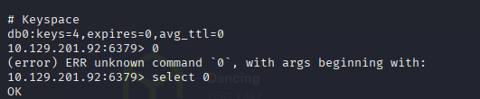

# h5 Kohti omaa treeniä

Raporttia on tehty 4.5.2025 klo. 15.30 - 

Tässä raportissa tehdyt tehtävät ovat osana Tero Karvisen tunkeutumistestaus kurssia. Materiaalit ovat luettavissa osoitteessa: (https://terokarvinen.com/tunkeutumistestaus/).

Tehtävät tehty seuraavalla laitteistolla:

    Malli: Msi GE75 Raider 10sf
    OS: Windows 10 Home 64-bit
    RAM: 16 GB
    CPU: Intel(R) Core(TM) i7-10750H CPU @ 2.60GHz (12 CPUs), ~2.6GHz
    GPU: NVIDIA GeForce RTX 2070
    BIOS: E17E9IMS, 10A

Kali virtuaalkone:

Tehtäviä tehdessä tein uuden virtuaalikoneen, jonne laitoin palomuuri asetukset siten, ettei muusta verkosta, kuin hacktheboxin labroista tullut liikennettä tai mennyt liikenettä.

Seuraavilla komennoilla eväsin lähtevän ja tulevan liikenteen.

    sudo ufw default deny outgoing
    sudo ufw default deny incoming

    sudo ufw allow out on tun0 to 10.10.0.0/16
    sudo ufw allow out on tun0 to 10.129.0.0/16

    sudo ufw allow in on tun0 from 10.10.0.0/16
    sudo ufw allow in on tun0 from 10.129.0.0/16

## x) tiivistelmä
 
## a) HTB Dancing

Tehtävässä oli tarkoituksena tehdä Hack the box sivuston starting point tehtävä nimeltä Dancing.

Aloitin tehtävän tekemällä uuden kali virtuaalikoneen.

Sallin palomuurista liikenteen Hack the boxin laboratorio osoitteisiin. Ja eväsin pääsyn muihin osoitteisiin. 

## b) HTB Responder

Tehtävässä oli tarkoituksena tehdä Hack the box sivuston starting point tehtävä nimeltä Responder. Responder tehtävssä oli 11 kysymystä mihin piti vastata.

Openvpn yhteys vielä aktiivisena, joten tähän ei tarvitse koskea. Painoin vain "spawn machine" painiketta.

### 1) Mikä TCP portti on auki koneessa.

Tehdään porttiskannaus parametreilla:

    nmap -T4 -p- -sV 10.129.201.92

Vastaus oli seuraava:

Eli portti 6379/tcp on auki

### 2) Mikä palvelu pyörii

Redis niminen palvelu pyöri portissa

### 3) Minkä tyyppinne tietokanta on redis

Vastauskenttä antoi tähän vastauksen "**_****** ********" Eli, jos vaihtoehtoina on in-memory database tai traditional database, niin omalla logikaalla se on tuo "in-memory".

Redis on in-memory tietokanta palvelu. Eli tämä on muistin päällä kovalevyn sijasta.

### 4) Eli millä cli-utilityllä päästään käsiksi redikseen.

DuckDuckGo hakukoneeseen syöte "Which command-line utility is used to interact with the Redis server? Enter the program name you would enter into the terminal without any arguments. (hack the boxin kysymys)"

Ensimmäisenä tuli mozillan tekoälyn vastaus "redis-cli" Ja se oli myös vastaus.

### 5) millä lipulla merkataan isäntä

Hakukoneeseen kysymyksen syöttäminen. Ja tekoäly antoi vastauksen "-h" Sama näkyi myös [stackoverflowin](https://stackoverflow.com/questions/40678865/how-to-connect-to-remote-redis-server#60953749) sivulla.

Vastaus oli "-h"

### 6 Millä komennolla saadaan tietoa redis palvelimelta

Hakukoneeseen taas hack the boxin kysymys. Ja ensimmäinen [linkki](https://redis.io/docs/latest/commands/info/) näyttää lupaavalta (rediksen dokumentaatiot).

Komento "info" oli vastaus.

### 7 Mikä on redis palvelimen versio. Se näkyi jo porttiskannauksen tuloksessa.

Vastaus oli 5.0.7

### 8 Millä komenolla valitaan haluttu tietokanta rediksessä.

Hakukone antaa tulokseksi "select" vastauksen (tekoälyn luoma) ja ylinlinkki on rediksen dokumentaatio selectistä, eli hyvällä omatunnolla vastasin "select" oikein meni.

### 9 Montako avainta löytyy indexistä 0

Nyt täytyi asentaa redis, jotta voin tutkailla tietokantaa. Asensin rediksen komennolla:

    sudo apt-get install redis

Kokeilin alkuun "redis-cli" ei toiminut.

Kun sain rediksen asennettua, niin kokeilin kirjautua kohteeseen tämän ip-osoitetta käyttäen komennolla:

    redis-cli -h 10.129.201.92

Onnistui ja täältä tuli uudestaan versio esille.

Sitten kokeilin select parametrilla index 0

    select 0

Vastauksena tuli ok. Noh kuvassa näkyy "db0:keys=4" eli tietokannassa "0" on 4 avainta. Kokeilin sitten antaa vastaukseksi 4 ja se oli oikein.

### Millä komennolla saadaa avaimet

Taas hakukonetta käyttämään. Taas heti tuli tulosta ilman yhtään linkin avaamista "KEYS *" Mutta myös rediksen dokumentaatiot tukivat tätä komentoa.

* KEYS * = avaimet kaikki (tähti tarkoittaa kaikkia)

ja tämä oli myös vastaus kysymkseen.

ja sitten kokeilin getillä saada "flag" nimistä avainta.

### anna lippu

Copy-pastesin lipun ja kone pwnattu

## Lähdeluettelo:

T. Karvinen 2025: Tunkeutumistestaus. Luettavissa: (https://terokarvinen.com/tunkeutumistestaus/) Luettu 4.5.2025

T. Karvinen 2025: Start Your Research with a Review Article. Luettavissa: (https://terokarvinen.com/review-article/) Luettu 4.5.2025

CryptoCat 2021: Youtube video: Tier 0: HackTheBox Starting Point - 5 Machines - Full Walkthrough (for beginners). Katsottavissa: (https://www.youtube.com/watch?v=jQ194vU4Qkk) Katsottu 4.5.2025

Stack Overflow: How to connect to remote Redis server? Luettavissa: (https://stackoverflow.com/questions/40678865/how-to-connect-to-remote-redis-server) Luettu 4.5.2025

Redis: INFO. Luettavissa: (https://redis.io/docs/latest/commands/info/) Luettu 4.5.2025

Redis: SELECT. Luettavissa: (https://redis.io/docs/latest/commands/select/) Luettu 4.5.2025

Redis: KEYS. Luettavissa: (https://redis.io/docs/latest/commands/keys/) Luettu 4.5.2025

Wikipedia: Redis. Luettavissa: (https://en.wikipedia.org/wiki/Redis) Luettu 4.5.2025
