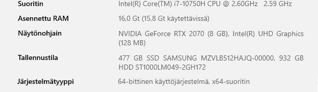

# h6_maalisuora

Raporttia on tehty 13.5.2025 klo. 20.00 - 

Tässä raportissa tehdyt tehtävät ovat osana Tero Karvisen tunkeutumistestaus kurssia. Materiaalit ovat luettavissa osoitteessa: (https://terokarvinen.com/tunkeutumistestaus/).

Raportin tehtävissä käytetty laitteisto:

## x) Tiivistelmä, [Let's Copy the Key to T-Pain's New Place 🔑](https://www.youtube.com/watch?v=JoRyv4ANhM4)

* Jos otat avaimesta kuvan ja jaat sen verkossa, niin tämän perusteella voidaan tehdä avaimesta kopio.
* Kuva asetetaan muottiin, josta voi päätellä urien leikkauksen. 
* keygen.co sivustolla voi tehdä tietyistä avainmalleista 3d-mallinuksia.
* Omana tulkintana voisin sanoa, että jos avaimessa on leikattuja uria, niin älä jaa avaimesta kuvia.

## a) Lippuvalmistelu

* Kali virtuaalkone.
* amd64 järjestelmä näkyy laitteisto kuvassa.
* Estän virtuaalikoneelta pääsyn verkkoon, joko palomuurista käsin "sudo ufw default deny outgoing" tai katkaisen yhteyden ylänurkasta.
* Koneelle ei ole asennettu mitään mitä kurssin aikana ei olla käsitelty.

## b) Oma korkki

Tässä lähdin sitten tutustumaan tarkemmin metasploitable2:n mille suoritettiin kurssin alussa porttiskannausta.

## Lähteet:

T. Karvinen 2025: Tunkeutumistestaus. Luettavissa: (https://terokarvinen.com/tunkeutumistestaus/) Luettu 13.5.2025

DeviantOllam 2022: Youtube video, Let's Copy the Key to T-Pain's New Place 🔑. Katsottavissa: (https://www.youtube.com/watch?v=JoRyv4ANhM4) Katsottu 13.5.2025
